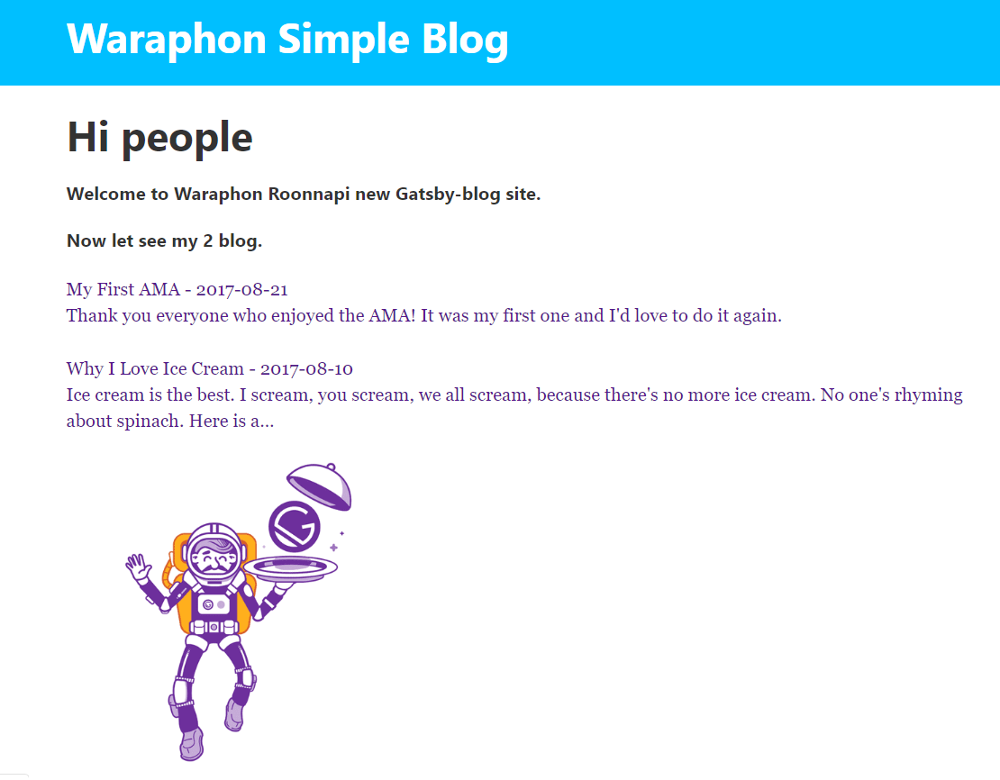

<!-- CONTENT:START (STARTER) 🚀 🧐 🎓 💫-->

#  Gatsby-Blog - Gatsby Technology Web App Development 
## By Complete react developer course.

    

Project from  - [Udemy'Andrei Neagoie Complete React Developer course.](https://www.udemy.com/course/complete-react-developer-zero-to-mastery/)

Click to see - [Live Website](https://blissful-mclean-c68d09.netlify.com/)

## 🚀 Features
- Simple blog
- Create pages from markdown
- Gennarate route from markdown slug

## 🧐 Install && Run
- npm install
- npm start

## 💫 Platform as a service
 - netlify
 
## License - [MIT](./LICENSE)

<!-- CONTENT:END -->
